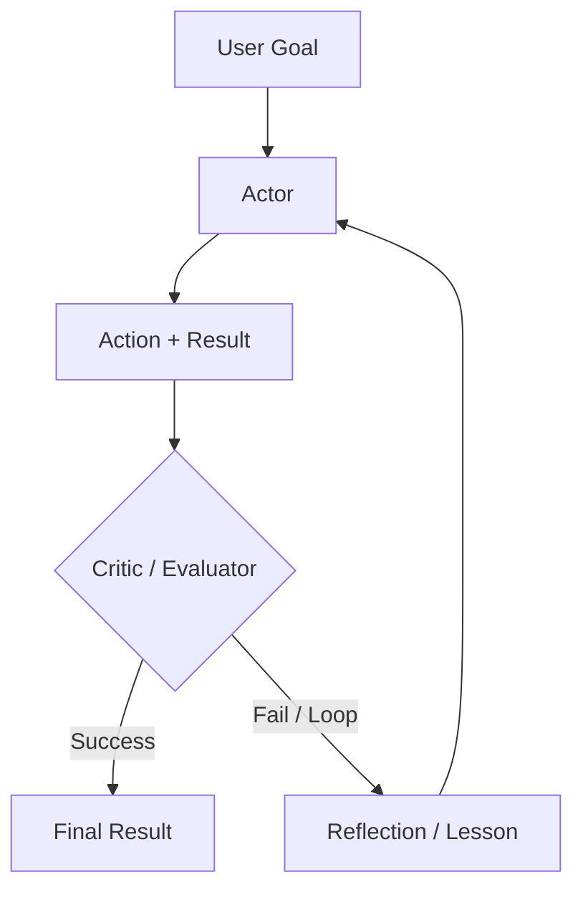

# Reasoning Loops: ReAct and Beyond (Dec 2025)

Reasoning Loops define the control flow of an agent. While **ReAct** was the 2023 baseline, late 2025 systems use more sophisticated patterns like **Plan-and-Solve**, **Self-Reflexion**, and **Inference-Time Scaling**.

## Table of Contents

- [The Evolution of the Loop](#evolution)
- [ReAct: The Classic Pattern](#react)
- [Self-Reflexion Loops](#reflexion)
- [Plan-and-Solve (Soto)](#plan-and-solve)
- [Flow Engineering (The LangGraph Pattern)](#flow-engineering)
- [Interview Questions](#interview-questions)
- [References](#references)

---

## The Evolution of the Loop

| Era | Pattern | Core Philosophy |
|-----|---------|-----------------|
| **2023** | ReAct | Interleave thought and action. |
| **2024** | Reflexion | Evaluate errors and re-try. |
| **2025** | System 2 Loops | Use hidden CoT for robust multi-step logic. |

---

## ReAct: Reasoning + Acting

The fundamental loop for 90% of agents:
1. **Thought**: "I need to find X."
2. **Action**: `search_engine("X")`
3. **Observation**: "X is at Y."
4. **Repeat**.

**2025 Critique**: ReAct is fragile. If the search returns "No results," a naive ReAct agent will often try the same search again. Modern loops inject **"Negative Constraints"** (e.g., "Don't try search results we've already seen").

---

## Self-Reflexion Loops

Reflexion adds a **"Critic"** step to the loop.

**The 2025 Benefit**: By storing these "Reflections" in short-term memory, the agent builds a "Mental Map" of what doesn't work during the current session.

---

## Plan-and-Solve

Instead of deciding one step at a time (greedy approach), the agent creates a **Static Plan** first, then executes it.

1. **Planner**: "I will do A, then B, then C."
2. **Executor**: Carries out the steps.
3. **Re-planner**: If step B fails, trigger a full re-plan rather than a local fix.

**Why?**: Planning reduces "Stochastic Errors." By committing to a path, the model is less likely to get distracted by noisy tool results.

---

## Flow Engineering (LangGraph)

In late 2025, we have moved from "Chat interfaces" to **"State Machines."**

- **Cyclic Graphs**: Instead of a linear sequence, we define a graph where the model can loop back to a "Cleaning" node or a "Validation" node multiple times.
- **Micro-Agents**: Each node in the graph is a specialized "Prompt" or "Tool."

**Key Nuance**: The "Agent" is no longer just the LLM; the agent is the **Graph Execution Engine**.

---

## Interview Questions

### Q: When would you use a "Reasoning Loop" (ReAct) vs. a "Plan-and-Solve" architecture?

**Strong answer:**
I choose **ReAct** for **Exploratory** tasks where the environment is unpredictable (e.g., browsing a new website where you don't know the URL structure yet). The agent needs to react to every observation. I choose **Plan-and-Solve** for **Predictable** but complex workflows (e.g., generating a financial report from 5 known APIs). Planning prevents the model from "meandering" and allows for better parallelization of steps that don't depend on each other.

### Q: What is "Inference-Time Scaling" and how does it relate to Agentic Loops?

**Strong answer:**
Inference-Time Scaling (often associated with OpenAI's o1) refers to spending more compute *during the response generation* rather than just during training. In an agentic context, this means the model doesn't just output the first valid-looking action. It uses a **Search Tree** (like Monte Carlo Tree Search) to simulate different action paths internally before committing to the one most likely to succeed. This reduces the number of "Real World" tool calls needed, saving external API costs and reducing failure rates.

---

## References
- Yao et al. "ReAct: Synergizing Reasoning and Acting" (2022/2025 update)
- Shinn et al. "Reflexion: Language Agents with Iterative Homeostatic Learning" (2024)
- Wang et al. "Plan-and-Solve Prompting" (2023)

---

*Next: [Tool Use and the Model Context Protocol (MCP)](03-tool-use-and-mcp.md)*
