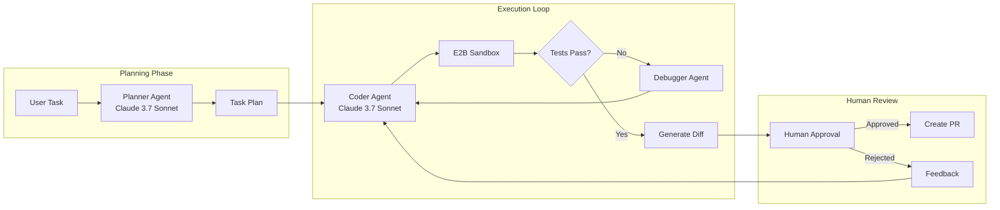
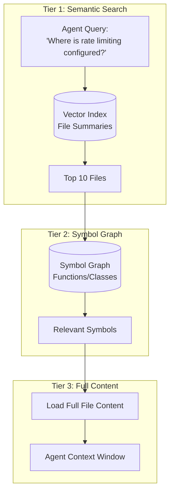

# Case Study: Autonomous Coding Agent

## The Problem

A developer tools company wants to build an **AI coding assistant** that can autonomously complete multi-file tasks: "Add authentication to this Express API" or "Refactor this module to use dependency injection."

**Constraints given in the interview:**
- Must work on codebases with 1,000+ files
- Cannot break existing functionality (tests must pass)
- Human must approve changes before commit
- Budget: under $0.50 per task completion

---

## The Interview Question

> "Design a coding agent that can take a task like 'Add rate limiting to all API endpoints' and produce a working, tested pull request."

---

## Solution Architecture



---

## Key Design Decisions

### 1. Why Separate Planner and Coder Agents?

**Answer:** The planning task requires **reasoning about the entire codebase** (which files to touch, what dependencies exist). The coding task requires **precise syntax generation**. By separating them, we can use extended thinking mode for planning and fast generation for coding. This also lets us checkpoint after planning for human review of the approach before execution.

### 2. Why E2B Sandbox Instead of Local Execution?

**Answer:** Security. The agent generates and runs code. Running it locally exposes the host system. E2B provides an isolated container that resets after each session. If the agent generates `rm -rf /`, it only destroys the sandbox.

### 3. Why Claude 3.7 Sonnet for Both?

**Answer:** Claude 3.7 Sonnet has the best code generation benchmarks (SWE-bench) in late 2025, and its hybrid reasoning mode gives us planning depth when needed. For the coding agent specifically, we enable "Extended Thinking" only on debugging loops, not on initial generation, to control costs.

---

## The Codebase Understanding Problem

The agent cannot fit 1,000 files into context. We solve this with **Tiered Retrieval**:



**Implementation:**
1. **Index file summaries** (generated by a smaller model during onboarding)
2. **Build a symbol graph** using tree-sitter for AST parsing
3. **Retrieve in stages**: summaries → symbols → full content

---

## The Self-Correction Loop

Agents fail. The key to reliability is **structured self-correction**:

```python
async def execute_with_retry(task: str, max_attempts: int = 3):
    for attempt in range(max_attempts):
        # Generate code
        code_changes = await coder_agent.generate(task)
        
        # Apply to sandbox
        sandbox.apply_changes(code_changes)
        
        # Run tests
        test_result = await sandbox.run_tests()
        
        if test_result.passed:
            return code_changes
        
        # Feed failure back to agent
        task = f"""
        Previous attempt failed. Error:
        {test_result.error}
        
        Original task: {task}
        
        Fix the issue.
        """
    
    raise MaxRetriesExceeded()
```

---

## Cost Breakdown

| Phase | Model | Tokens (avg) | Cost |
|-------|-------|--------------|------|
| Planning | Claude 3.7 (Extended) | 8,000 in / 2,000 out | $0.06 |
| File Retrieval | Embeddings | 50,000 | $0.01 |
| Coding (per attempt) | Claude 3.7 | 15,000 in / 3,000 out | $0.09 |
| Testing (3 runs avg) | - | - | $0.00 |
| **Total (1.5 attempts avg)** | | | **$0.21** |

Under budget at $0.21 per task.

---

## Interview Follow-Up Questions

**Q: How do you handle tasks that require changes across 20+ files?**

A: We break them into sub-tasks during planning. The planner outputs a DAG of changes with dependencies. The executor processes them in topological order, running tests incrementally. If step 5 breaks, we only re-run steps 5+ not the whole task.

**Q: What if the agent gets stuck in an infinite retry loop?**

A: Three safeguards: (1) Max attempt limit (3). (2) If the same test fails with the same error twice, escalate to human. (3) Total token budget per task ($0.50) triggers termination.

**Q: How do you prevent the agent from introducing security vulnerabilities?**

A: We run a static analysis tool (Semgrep) in the sandbox as part of the test suite. Security rule violations are treated as test failures and fed back to the agent for correction.

---

## Key Takeaways for Interviews

1. **Separate planning from execution** for checkpointing and cost control
2. **Sandbox all generated code** for security (E2B, Docker, etc.)
3. **Tiered retrieval solves large codebase scale**: summaries → symbols → content
4. **Self-correction loops need hard limits**: attempts, tokens, time

---

*Related chapters: [Tool Use and MCP](../07-agentic-systems/03-tool-use-and-mcp.md), [Error Handling](../07-agentic-systems/07-error-handling-and-recovery.md)*
