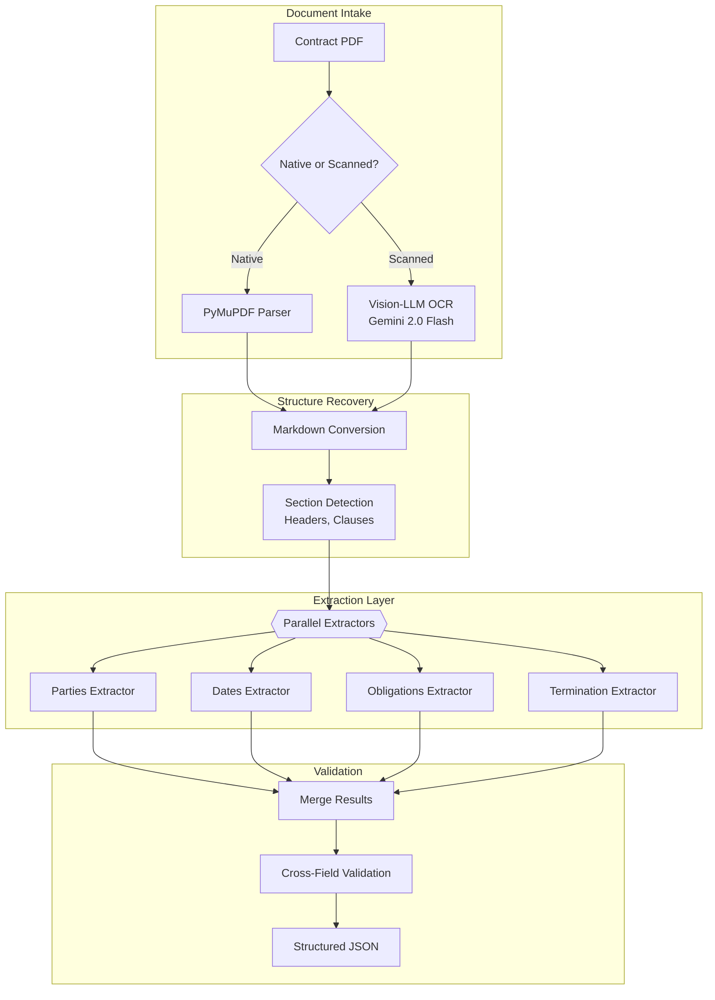
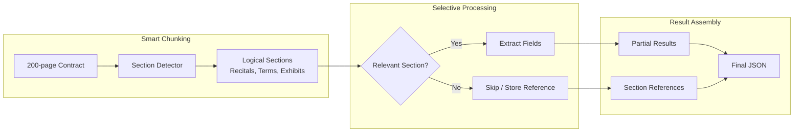

# Case Study: Document Intelligence Pipeline

## The Problem

A legal tech company needs to process **50,000 contracts per month**, extracting key terms (parties, dates, obligations, termination clauses) and loading them into a searchable database.

**Constraints given in the interview:**
- Documents range from 2 to 200 pages
- Mix of scanned PDFs and native digital
- Multi-language (English, German, French, Spanish)
- Extraction accuracy: 95%+ on key fields
- Cost target: under $0.50 per document

---

## The Interview Question

> "Design a pipeline that takes a 100-page contract PDF and extracts structured data like parties, effective date, termination conditions, and payment terms into JSON."

---

## Solution Architecture



---

## Key Design Decisions

### 1. Vision-LLM for OCR Instead of Traditional OCR

**Answer:** Scanned contracts often have stamps, handwritten annotations, and complex layouts (tables, multi-column). Traditional OCR (Tesseract) produces garbled output. Gemini 2.0 Flash "sees" the layout and produces clean Markdown with tables preserved. Cost is higher but accuracy gain is worth it.

| Method | 100-page Scanned Contract | Accuracy | Cost |
|--------|---------------------------|----------|------|
| Tesseract | Noisy, broken tables | 60% | $0.02 |
| AWS Textract | Better, still struggles with layout | 75% | $0.15 |
| Gemini 2.0 Flash | Clean Markdown, tables intact | 92% | $0.35 |

### 2. Parallel Extractors vs Single-Pass

**Answer:** A single prompt asking for all fields produces worse results than specialized extractors. Each extractor has a focused prompt and schema:

```python
parties_schema = {
    "type": "object",
    "properties": {
        "party_a": {"type": "object", "properties": {
            "name": {"type": "string"},
            "role": {"type": "string"},
            "address": {"type": "string"}
        }},
        "party_b": {"type": "object", "properties": {...}}
    }
}

# Each extractor runs in parallel
async def extract_all(document: str):
    results = await asyncio.gather(
        extract_parties(document, parties_schema),
        extract_dates(document, dates_schema),
        extract_obligations(document, obligations_schema),
        extract_termination(document, termination_schema)
    )
    return merge_results(results)
```

### 3. Cross-Field Validation

**Answer:** Extraction errors often reveal themselves through inconsistencies:
- If `effective_date` is after `termination_date`, something is wrong
- If `party_a` name appears in `obligations` but spelled differently, flag for review
- If `payment_amount` is extracted but `payment_frequency` is null, incomplete

---

## Handling 200-Page Documents

The context window challenge:



**Key insight:** Not all 200 pages contain extractable fields. Exhibits (attached original documents) are stored as references, not processed. The "Terms and Conditions" section is often 80% of the document but contains most key fields.

---

## Multilingual Handling

German contracts use different structures than English ones. We maintain language-specific extractors:

```python
EXTRACTORS = {
    "en": {
        "parties": EnglishPartiesExtractor(),
        "dates": StandardDatesExtractor(),
        "termination": EnglishTerminationExtractor()
    },
    "de": {
        "parties": GermanPartiesExtractor(),  # Handles "GmbH", "AG" patterns
        "dates": GermanDatesExtractor(),       # DD.MM.YYYY format
        "termination": GermanTerminationExtractor()  # "Kündigung" patterns
    }
}
```

---

## Cost Breakdown

| Stage | Cost per 100-page Doc |
|-------|----------------------|
| OCR (Gemini 2.0 Flash, if scanned) | $0.18 |
| Section detection (GPT-4o-mini) | $0.03 |
| Field extraction (4 parallel, GPT-4o-mini) | $0.12 |
| Validation | $0.02 |
| **Total (scanned)** | **$0.35** |
| **Total (native PDF)** | **$0.17** |

Average (60% native, 40% scanned): **$0.24 per document** (under $0.50 target)

---

## Interview Follow-Up Questions

**Q: What if the extraction confidence is low?**

A: We output a confidence score per field. Fields below 0.8 are flagged for human review. The UI shows a "review queue" where humans validate only uncertain fields, not entire documents. This reduces human effort to an average of 30 seconds per document.

**Q: How do you handle contracts with non-standard layouts?**

A: We maintain a "layout library" of known contract templates. The section detector first tries to match against known templates. If no match, it falls back to heuristic detection (looking for numbered sections, ALL CAPS headers, etc.). Unknown layouts are flagged and added to the library after human review.

**Q: What about contracts where key terms are defined in exhibits?**

A: We detect cross-references ("as defined in Exhibit A") and resolve them. The extraction prompt includes relevant exhibit content when the main document references it. This prevents "null" extractions when the answer is in an attachment.

---

## Key Takeaways for Interviews

1. **Vision-LLMs beat traditional OCR** for complex layouts (tables, annotations)
2. **Parallel specialized extractors outperform single-pass** for structured extraction
3. **Cross-field validation catches extraction errors** before they reach the database
4. **Not all pages need processing**: detect relevant sections, skip exhibits

---

*Related chapters: [OCR and Layout](../10-document-processing/01-ocr-and-layout.md), [Structured Generation](../05-prompting-and-context/06-structured-generation.md)*
