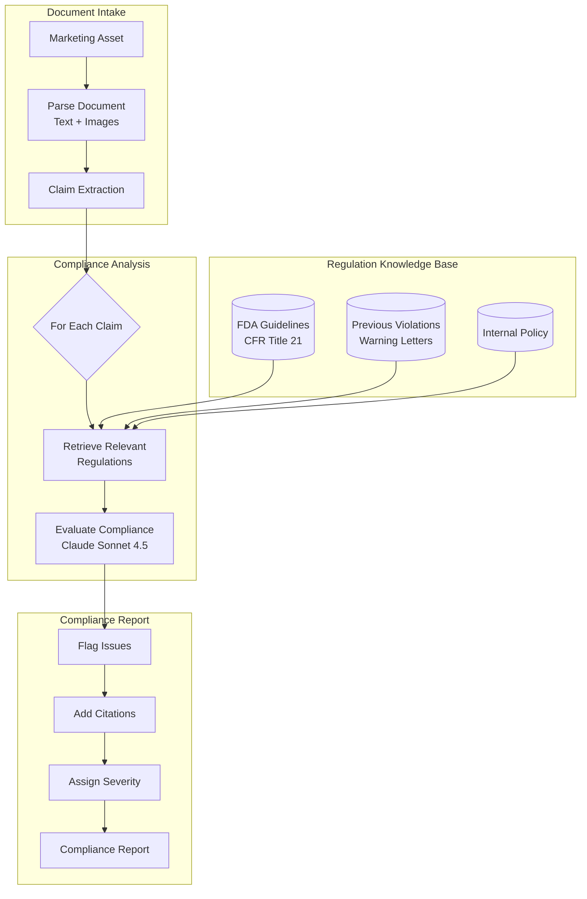
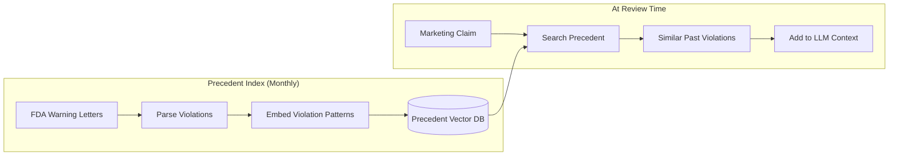
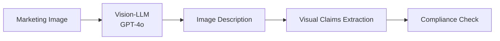

# Case Study: Regulatory Compliance Automation

## The Problem

A pharmaceutical company must ensure all marketing materials comply with **FDA regulations**. Currently, legal review takes 2 weeks per asset. They want AI to pre-screen materials and flag issues, reducing legal review to 2 days.

**Constraints given in the interview:**
- Must cite specific regulation sections, not just "this seems wrong"
- False negatives (missing violations) are unacceptable
- False positives (over-flagging) should be under 20%
- 500 marketing assets per month
- Audit trail required for regulatory inspection

---

## The Interview Question

> "Design a system that reviews pharmaceutical marketing materials and identifies specific regulatory violations with citations."

---

## Solution Architecture



---

## Key Design Decisions

### 1. Claim Extraction Before Compliance Check

**Answer:** Marketing materials are dense. Checking the entire document against regulations is inefficient. We first extract individual **claims**:

```python
claims = extract_claims(document)
# Example output:
# [
#   {"text": "Reduces symptoms by 80%", "type": "efficacy", "location": "page 2, para 3"},
#   {"text": "No side effects reported", "type": "safety", "location": "page 3, header"},
#   {"text": "Recommended by doctors", "type": "endorsement", "location": "page 1, image"}
# ]
```

Each claim is then checked independently against relevant regulations.

### 2. Why RAG Over Fine-Tuning for Regulations?

**Answer:** Regulations change. FDA updates guidance documents monthly. Fine-tuning would require retraining after each update. RAG allows us to:
- Update the regulation index immediately when new guidance is released
- Track which version of regulations was used for each review (audit trail)
- Show the exact source passage to legal reviewers

### 3. Conservative Flagging Strategy

**Answer:** False negatives (missed violations) are catastrophic; false positives (extra review) just cost time. We use a **threshold hierarchy**:

| Confidence | Action |
|------------|--------|
| >90% violation | Flag as HIGH severity |
| 70-90% potential | Flag as MEDIUM, cite concern |
| 50-70% unclear | Flag as LOW, note ambiguity |
| <50% likely compliant | No flag, but log for audit |

We never output "compliant" without logging the reasoning.

---

## The Precedent Database

Regulations are often ambiguous. Previous FDA warning letters clarify how rules are enforced:



**Why this matters:** A claim like "clinically proven" might seem fine based on regulations alone. But if we find 5 warning letters where FDA cited companies for using "clinically proven" without specific trial data, that is a red flag.

---

## The Audit Trail Requirement

Every decision must be traceable:

```python
compliance_decision = {
    "claim_id": "claim_003",
    "claim_text": "No side effects reported",
    "decision": "VIOLATION",
    "severity": "HIGH",
    "regulation_cited": "21 CFR 202.1(e)(5)",
    "regulation_text": "Advertisements shall not contain claims that...",
    "precedent_cited": "Warning Letter 2023-FDA-04521",
    "reasoning": "Claim implies absolute safety, which contradicts...",
    "model_used": "claude-3-7-sonnet-20251022",
    "timestamp": "2025-12-21T10:30:00Z",
    "reviewer_id": null,  # Filled when human reviews
    "final_decision": null  # Filled after legal review
}
```

---

## Handling Images and Video

Pharmaceutical marketing includes visual claims (happy patients, before/after images):



**Example:** An image showing a patient running implies efficacy. If the drug is for arthritis, we check if clinical trials support "improved mobility" claims.

---

## Cost Analysis

| Stage | Cost per Asset |
|-------|----------------|
| Document parsing | $0.05 |
| Claim extraction | $0.15 |
| Regulation retrieval | $0.02 |
| Compliance evaluation (per claim, avg 12 claims) | $1.80 |
| Image analysis (avg 5 images) | $0.75 |
| Report generation | $0.10 |
| **Total** | **$2.87** |

For 500 assets/month: **$1,435/month** (vs. $50K+/month for equivalent legal hours)

---

## Interview Follow-Up Questions

**Q: How do you handle regulations that require human judgment?**

A: We do not replace humans; we triage. The system flags issues with confidence scores. Low-confidence flags go to senior counsel. High-confidence clear items skip detailed review. This reduces the 2-week review to 2 days by focusing human attention on edge cases.

**Q: What if FDA updates a regulation mid-month?**

A: We have a "Regulation Watch" service that monitors FDA RSS feeds and Federal Register updates. When a relevant update is detected, we re-index and flag any recent reviews that might be affected by the change.

**Q: How do you explain the AI's reasoning to regulators during an audit?**

A: Every decision includes the full reasoning chain: the claim extracted, the regulation retrieved, the precedent cited, and the model's evaluation. We can show regulators exactly why a decision was made, with version numbers for all components.

---

## Key Takeaways for Interviews

1. **Claim extraction first**: break complex documents into reviewable units
2. **Precedent databases beat pure regulation text**: how rules are enforced matters
3. **Conservative thresholds for high-stakes domains**: optimize for recall, not precision
4. **Audit trails are architecture**: design for explainability from day one

---

*Related chapters: [RAG Fundamentals](../06-retrieval-systems/01-rag-fundamentals.md), [Guardrails Implementation](../13-reliability-and-safety/01-guardrails-implementation.md)*
