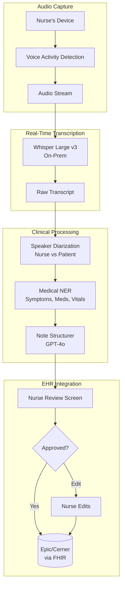
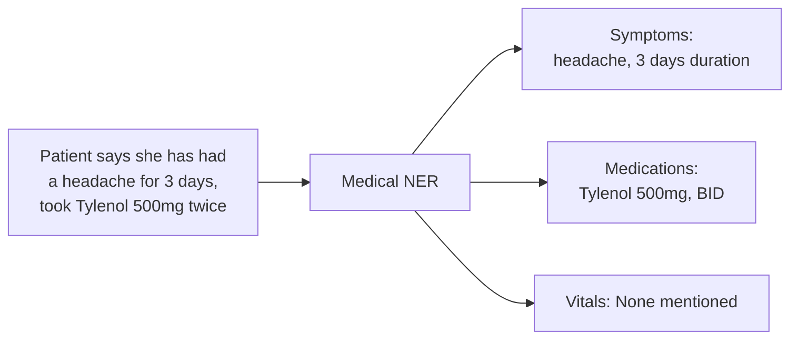

# Case Study: Voice AI Assistant for Healthcare

## The Problem

A hospital network wants a **voice-based AI assistant** that helps nurses document patient encounters. The nurse speaks naturally; the AI produces structured clinical notes in real-time.

**Constraints given in the interview:**
- HIPAA compliance (PHI handling)
- Works in noisy hospital environments
- Real-time transcription (under 500ms latency)
- Must use medical terminology correctly
- Integration with existing EHR (Epic/Cerner)

---

## The Interview Question

> "Design a voice assistant that a nurse can speak to during a patient visit, and it generates a structured clinical note in the EHR."

---

## Solution Architecture



---

## Key Design Decisions

### 1. On-Premise ASR for HIPAA

**Answer:** PHI cannot leave the hospital network without encryption and BAA. We deploy Whisper Large v3 on local GPU servers rather than using cloud APIs:

| Option | Latency | HIPAA | Cost |
|--------|---------|-------|------|
| Cloud ASR (OpenAI) | 200ms | Requires BAA, data leaves network | $0.006/min |
| On-prem Whisper | 150ms | Full control, no data egress | $0.002/min (amortized GPU) |

On-prem wins on both latency and compliance.

### 2. Speaker Diarization: Who Said What

**Answer:** The note must distinguish "Patient reports headache" from "Nurse observes patient grimacing." We use:

```python
# Pyannote for speaker diarization
diarization = pipeline("audio.wav")
# Output: [(0.0, 1.5, "SPEAKER_0"), (1.5, 4.2, "SPEAKER_1"), ...]

# Map speakers based on voice profile
roles = identify_roles(diarization, known_nurse_voiceprint)
# Output: {"SPEAKER_0": "nurse", "SPEAKER_1": "patient"}
```

The nurse's device captures their voiceprint at setup for role identification.

### 3. Medical NER for Structured Extraction

**Answer:** We need structured data, not just prose. Medical NER extracts:



We use a fine-tuned BioBERT model for NER, not the LLM, because NER needs to be fast and deterministic.

---

## Handling Noisy Environments

Hospitals are loud. We use multiple strategies:

1. **Directional microphones** on nurse devices focus on nearby speech
2. **Noise-robust ASR models** (Whisper was trained on noisy data)
3. **Confidence thresholds**: if ASR confidence is <0.7, we flag for nurse review rather than guessing
4. **Keyword spotting**: medical terms have custom pronunciation models

---

## The Structured Note Format

The LLM produces SOAP-format notes:

```python
note_prompt = f"""
Generate a clinical SOAP note from this encounter transcript.

Transcript:
{transcript_with_speakers}

Extracted entities:
- Symptoms: {symptoms}
- Medications: {medications}
- Vitals: {vitals}

Output format:
S (Subjective): Patient's reported symptoms
O (Objective): Nurse's observations and measurements
A (Assessment): Clinical impression
P (Plan): Next steps, orders
"""
```

---

## EHR Integration (FHIR)

The output must be machine-readable for the EHR:

```json
{
  "resourceType": "DocumentReference",
  "status": "current",
  "type": {
    "coding": [{"system": "http://loinc.org", "code": "34117-2", "display": "History and physical note"}]
  },
  "subject": {"reference": "Patient/12345"},
  "author": [{"reference": "Practitioner/nurse789"}],
  "content": [{
    "attachment": {
      "contentType": "text/plain",
      "data": "base64-encoded-soap-note"
    }
  }],
  "context": {
    "encounter": {"reference": "Encounter/visit456"}
  }
}
```

---

## Latency Budget

| Stage | Target | Actual |
|-------|--------|--------|
| Audio capture to VAD | 50ms | 30ms |
| ASR transcription | 200ms | 150ms |
| Diarization | 100ms | 80ms |
| NER extraction | 50ms | 40ms |
| LLM structuring | 500ms | 450ms |
| **Total (end-to-end)** | **900ms** | **750ms** |

For real-time feel, we stream partial transcripts while NER and LLM run on completed sentences.

---

## Interview Follow-Up Questions

**Q: How do you handle medical abbreviations and jargon?**

A: We maintain a custom vocabulary list that maps abbreviations (PRN, BID, SOB) to full terms. This is injected into both the ASR model (for better recognition) and the LLM prompt (for correct expansion in notes).

**Q: What if the nurse makes a correction mid-sentence?**

A: We detect correction patterns ("actually, I mean...", "no wait, it's...") and use only the corrected version. The LLM is instructed to prefer later statements when conflicts exist.

**Q: How do you ensure the AI does not miss critical information?**

A: We have a "completeness check" that verifies the note includes all extracted entities. If NER found "chest pain" but the SOAP note does not mention it, we flag for nurse review. We also run a "safety critical" detector that escalates mentions of suicidal ideation, abuse, or other mandatory reporting triggers.

---

## Key Takeaways for Interviews

1. **On-prem for healthcare**: HIPAA often requires local processing
2. **Diarization is essential**: who said what matters clinically
3. **Hybrid extraction**: fast NER for structure, LLM for prose generation
4. **Always have human review**: especially for clinical documentation

---

*Related chapters: [Multimodal Models](../02-model-landscape/04-multimodal-models.md), [Reliability Patterns](../15-ai-design-patterns/05-reliability-patterns.md)*
