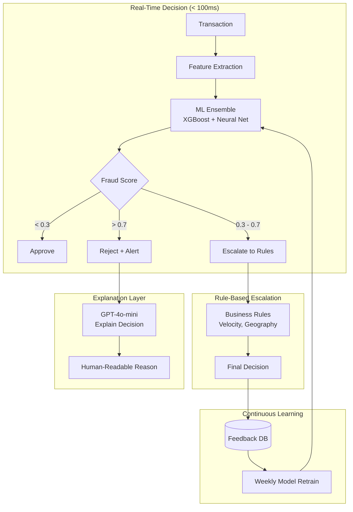
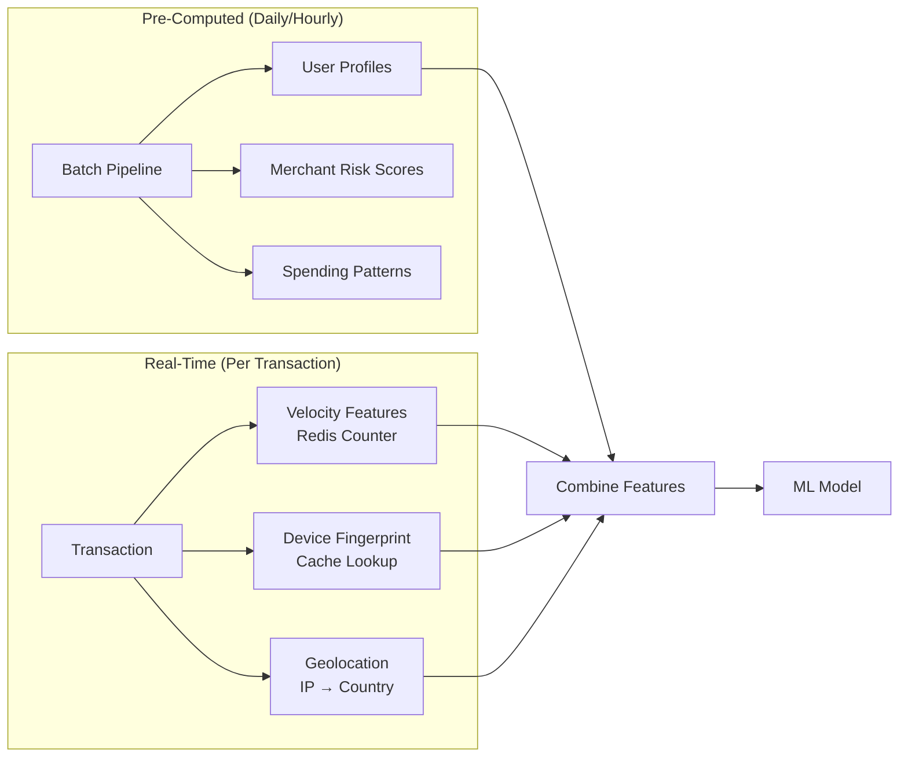
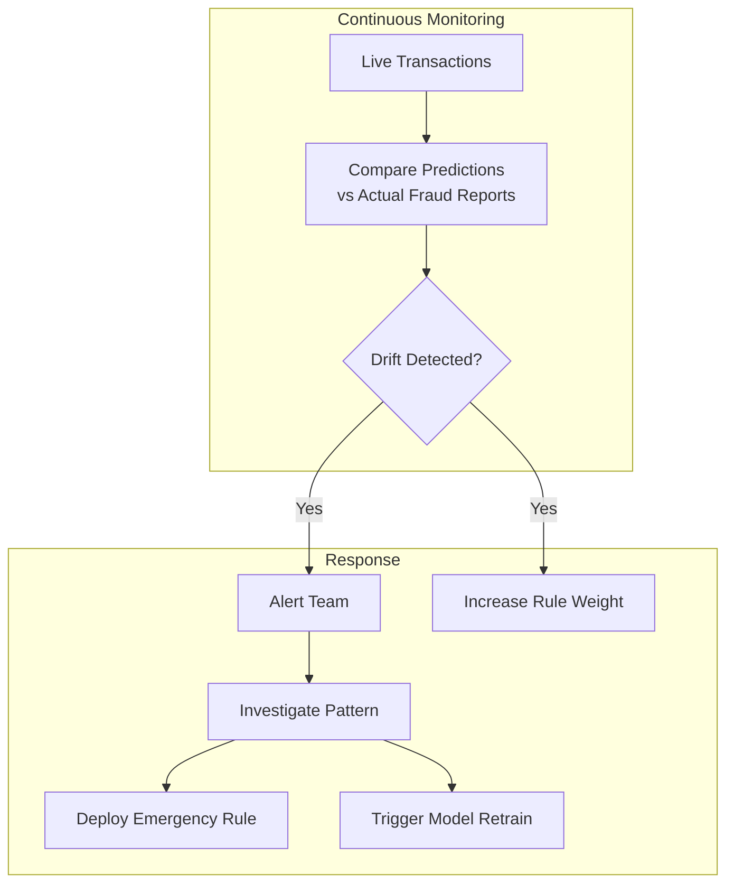

# Case Study: Real-Time Fraud Detection

## The Problem

A payment processor handles **10 million transactions per day**. They need to detect fraudulent transactions in real-time, blocking them before they complete, while minimizing false positives that frustrate legitimate customers.

**Constraints given in the interview:**
- Decision latency: under 100ms
- False positive rate: under 0.1% (1 in 1,000)
- Must explain why a transaction was flagged
- Regulations require 7-year audit trail
- Fraud patterns evolve constantly

---

## The Interview Question

> "Design a system that decides within 100ms whether to approve, reject, or escalate a credit card transaction, and can explain that decision."

---

## Solution Architecture



---

## Key Design Decisions

### 1. Why ML + Rules, Not Just ML?

**Answer:** Pure ML models are black boxes. Regulators require explainable decisions for disputes. We use ML for scoring, then apply transparent rules for final decisions:

| Layer | Role | Speed | Explainability |
|-------|------|-------|----------------|
| ML Ensemble | Catch complex patterns | 10ms | Low |
| Business Rules | Encode known fraud types | 5ms | High |
| Combined | Best of both | 15ms | Medium-High |

Rules examples: "Block if 5+ transactions in different countries within 1 hour" is explainable to regulators.

### 2. Three-Way Decision: Approve / Escalate / Reject

**Answer:** Binary approve/reject is too blunt. The "gray zone" (0.3-0.7 score) goes to rule-based escalation or human review for high-value transactions:

```python
def decide(transaction, fraud_score):
    if fraud_score < 0.3:
        return "APPROVE", None
    elif fraud_score > 0.7:
        reason = explain_rejection(transaction, fraud_score)
        return "REJECT", reason
    else:
        # Gray zone: apply business rules
        if check_velocity_rules(transaction):
            return "REJECT", "Velocity limit exceeded"
        if check_geography_rules(transaction):
            return "ESCALATE", "Unusual location"
        return "APPROVE", None
```

### 3. Why LLM for Explanation, Not SHAP/LIME?

**Answer:** SHAP values tell you "feature X contributed 0.3 to the score." Customers and regulators want "This transaction was flagged because it was made from a new device in a country you have never visited, for an amount 10x your usual purchase."

We generate natural language explanations using the feature importance as input:

```python
prompt = f"""
Explain why this transaction was flagged as potentially fraudulent.

Transaction details:
- Amount: ${amount}
- Merchant: {merchant}
- Location: {location}
- Device: {device}

Top contributing factors:
1. {factors[0]['feature']}: {factors[0]['contribution']}
2. {factors[1]['feature']}: {factors[1]['contribution']}
3. {factors[2]['feature']}: {factors[2]['contribution']}

Write a 2-sentence explanation for the cardholder.
"""
```

---

## Feature Engineering for Speed

100ms budget means features must be pre-computed:



**Key insight:** User profile (average spend, typical merchants, home geography) is computed offline. Real-time only adds transaction-specific features.

---

## Handling Evolving Fraud Patterns

Fraudsters adapt. Last month's model misses this month's attacks.



**Emergency rules** can be deployed in minutes (just a config update). Model retraining takes days but catches more subtle patterns.

---

## Interview Follow-Up Questions

**Q: How do you handle model latency spikes?**

A: We have a **fallback stack**. If the ML model does not respond within 50ms, we fall back to rule-based scoring only. The rules cover the most common fraud patterns. We also have a "default approve" for transactions under $10 if all systems are slow.

**Q: What about coordinated fraud attacks?**

A: We maintain global velocity counters (not just per-user). If we see 100 transactions to the same obscure merchant in 1 minute from different cards, that triggers a merchant-level block even if individual transactions look clean.

**Q: How do you balance fraud prevention with customer experience?**

A: We track the "insult rate": percentage of legitimate customers blocked. Each product team has an insult budget. If the fraud model's insult rate exceeds budget, we loosen thresholds automatically and alert the team. Better to accept slightly more fraud than to anger loyal customers.

---

## Key Takeaways for Interviews

1. **ML for scoring, rules for explainability**: combine both for regulated domains
2. **Three-way decisions reduce false positives**: gray zone gets extra scrutiny
3. **Pre-compute everything possible**: real-time budget is for combination only
4. **Continuous retraining is essential**: fraud patterns evolve weekly

---

*Related chapters: [Evaluation and Observability](../14-evaluation-and-observability/), [Reliability Patterns](../15-ai-design-patterns/05-reliability-patterns.md)*
