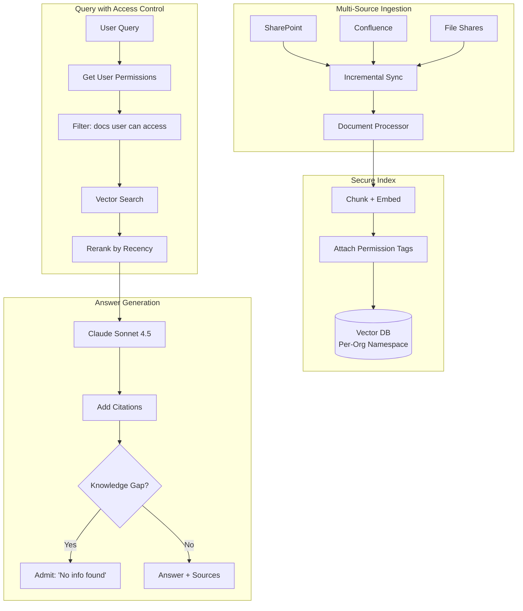
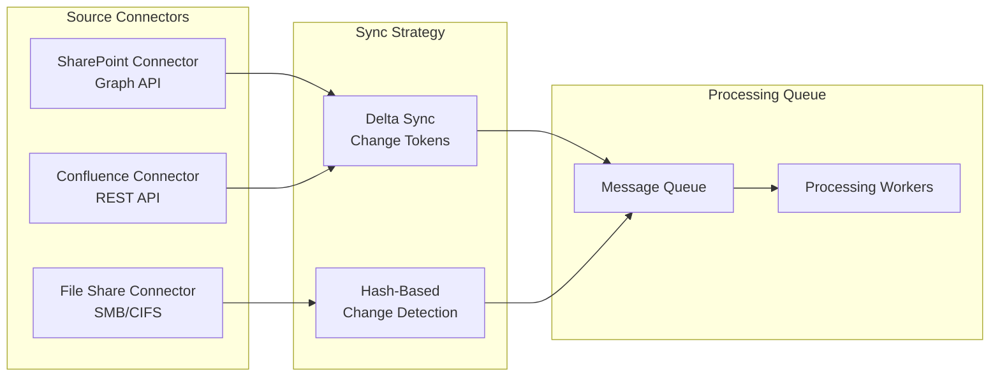

# Case Study: Enterprise Knowledge Management

## The Problem

A consulting firm with **10,000 employees** has decades of project reports, methodology documents, and expertise scattered across SharePoint, Confluence, and file shares. They want an AI system where consultants can ask "How did we approach supply chain optimization for automotive clients?" and get answers synthesized from internal knowledge.

**Constraints given in the interview:**
- 2 million documents across 15 data sources
- Access control: associates cannot see partner-level content
- Must cite sources for every claim
- Stale data handling: old methodologies should not override new ones
- Knowledge gaps should be identified, not hallucinated

---

## The Interview Question

> "Design an internal knowledge assistant where a junior consultant can ask questions and get answers based only on documents they're authorized to see."

---

## Solution Architecture



---

## Key Design Decisions

### 1. Permission-Aware Retrieval

**Answer:** Every chunk carries its permission metadata from the source system:

```python
chunk = {
    "content": "Our approach to automotive supply chain...",
    "source": "sharepoint://projects/acme-motors/final-report.docx",
    "permissions": {
        "read_groups": ["partners", "managers", "automotive-team"],
        "classification": "confidential"
    },
    "last_modified": "2024-03-15",
    "author": "jane.doe@firm.com"
}
```

At query time, we filter before retrieval:

```python
def search(query: str, user: User):
    user_groups = get_user_groups(user.id)
    
    return vector_db.search(
        query=query,
        filter={
            "permissions.read_groups": {"$in": user_groups}
        }
    )
```

### 2. Recency-Weighted Ranking

**Answer:** A 2024 methodology document should rank higher than a 2019 one for the same topic. We use a **decay function**:

```python
def recency_boost(doc_date):
    age_days = (today - doc_date).days
    # Half-life of 365 days
    return 0.5 ** (age_days / 365)

final_score = semantic_score * 0.7 + recency_boost(doc.date) * 0.3
```

This prevents outdated practices from drowning out current guidance.

### 3. Knowledge Gap Detection

**Answer:** We must distinguish "I found nothing" from "I'm making something up":

```python
def generate_answer(query: str, retrieved_docs: list):
    if len(retrieved_docs) == 0 or max_relevance_score < 0.5:
        return {
            "answer": "I could not find relevant information in our knowledge base for this query.",
            "confidence": "low",
            "suggestion": "Try contacting the Automotive Practice lead directly."
        }
    
    # Generate from retrieved content
    answer = llm.generate(query, context=retrieved_docs)
    return {"answer": answer, "confidence": "high", "sources": [d.source for d in retrieved_docs]}
```

---

## Multi-Source Synchronization



**Key insight:** SharePoint and Confluence support change tokens (delta sync). File shares require hash comparison. Both feed into a unified processing queue.

---

## Handling Conflicting Information

Different documents may have conflicting guidance. We surface this:

```python
def detect_conflicts(retrieved_docs):
    # Group by topic
    topics = cluster_by_topic(retrieved_docs)
    
    for topic, docs in topics.items():
        if has_contradictions(docs):
            return {
                "warning": "Found conflicting guidance",
                "perspectives": [
                    {"source": d.source, "date": d.date, "view": summarize(d)}
                    for d in docs
                ],
                "recommendation": "Defer to most recent document or consult practice lead."
            }
```

---

## Cost Analysis

| Component | Monthly Cost |
|-----------|--------------|
| Embedding (2M docs × updates) | $500 |
| Vector DB (Pinecone Enterprise) | $2,000 |
| LLM generation (50K queries) | $3,000 |
| Sync infrastructure (connectors) | $500 |
| **Total** | **$6,000/month** |

ROI: Consultants save an average of 2 hours/week searching for information. At 10,000 consultants × $100/hour × 2 hours × 4 weeks = $8M/month in productivity. System pays for itself 1,300x over.

---

## Interview Follow-Up Questions

**Q: How do you handle documents with mixed permissions?**

A: We chunk at the section level, and each section inherits the most restrictive permission from its ancestors. A paragraph in a "confidential" section within an otherwise "internal" document is tagged "confidential."

**Q: What about real-time collaboration documents (Google Docs, live Confluence pages)?**

A: We have a separate "live document" pipeline with more frequent sync (every 5 minutes vs daily for static files). These documents are flagged as "draft" in search results until they are finalized.

**Q: How do you prevent the system from becoming a leaky abstraction for unauthorized data?**

A: We never include unauthorized content in the LLM context, even to say "I cannot show you this." The system behaves as if unauthorized documents do not exist. This prevents inference attacks where users probe "do you have info about X?" to discover the existence of confidential projects.

---

## Key Takeaways for Interviews

1. **Permissions must be enforced at retrieval, not generation**: filter before the LLM sees content
2. **Recency weighting prevents stale knowledge**: old documents decay in relevance
3. **Admit gaps instead of hallucinating**: confidence thresholds and fallback messaging
4. **Multi-source sync is complex**: different APIs need different strategies

---

*Related chapters: [RAG Fundamentals](../06-retrieval-systems/01-rag-fundamentals.md), [Multi-Tenant Isolation](../12-security-and-access/04-multi-tenant-rag-isolation.md)*
